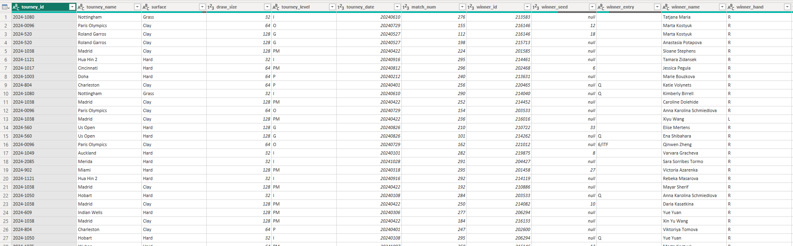

### BI-Analytics-Tennis
# By: Stephen Miller

This project was done primarily through Microsoft Power BI, with data cleaning, custom queries, and data visualizations being done within the app.

## Section 1. The Business Goal
You are a part of the WTA (Women's Tennis Association) and are in charge of giving out the end of year superlatives to players. We will analyze 2024 data to gives awards for The Strongest Arm (first serve win %), The Ace (most average aces per match), The Clutchest Player (Highest % of breakpoints saved), The Overtime Award (most time on court), Best All-Surface Player (highest average win rate across the 3 surfaces), All Right (highest win-rate vs right-handed opponents), and To The Left (highest win rate vs left-handed opponents).

## Section 2. Data Source
This was done with 2024 tennis data, pulled from this github: https://github.com/JeffSackmann/tennis_wta 
This came with the following tables:

# wta_players:

You'll notice there are some null values on this graph, but it isn't an issue for this specific project as these players were from decades ago, and thus less known, and they will not be relevant in any of our queries.

# wta_rankings_current:

This shows the rankings of each player at the end of 2024, but notice that the name is not displayed. We will mostly join the ranking in on other tables via the "player" column which corresponds to "player_id" on other tables.

# wta_matches_2024

This is the meat and potatoes of the data. Although we are only showing 12 columns, it has over 30 columns of data, which we will extract a lot of insights from.

## Section 3. Tools Used
Analysis was done through Microsoft Power BI.

## Section 4. Workflow & Logic
For this project, we made 3 unique tables that captured the data we needed for the awards. The specific query codes can be found in the Queries folder for the project, but we will share samples of the graphs here! The first is for the players' winrates vs certain right-handed players and left-handed players. 

# wta_hand_winrate

The next is the graph we used for players' win rates per surface. This has three rows per player (assuming they played on all surfaces) We did put a caveat that they had to play at least two matches on a surface to have it count. At first it was 5, but that cut a lot of people out of the grass win rate because 2024 was a very unique year. The grass season is always very short, but it coincided with the olympics run-up, which was on clay, so a lot of players skipped most of the grass season. We also added an extra column to combine the players name and rank to easily display it in our matrix later on.

# wta_surface_winrate

The final aggregates a variety of data, from serve quality to time on the court.

# wta_serve_minutes

## Section 5. Results (narrative + visualizations)
We combined this data into scatter plots, bar graphs, and matrices to visualize the data and determine our winners. We used two dashboards to house the information. The first focuses on data from the first two graphs, focusing on winrate by hand and surface.

# Dashboard 1

The matrix in the image above is sorted by the average win rates per surface, which gives us our first aware. To determine the top performer against right-handed players, we can click the data points on the scatter plot with the highest Y value, corresponding to win rate, like in the figure below. This can also be done for left-handed players.

The second dashboard focuses on data from our third table, which shows serve data, match duration, and clutch factor. 

Clutch factor is calculated by taking total break points saved over the total break points faced. Break points come with a lot of pressure. You are expected to win your service games more often than not, and break points are when you are 1 point from losing your service game. Clutch factor shows players who fight the pressure and come through when they need to.

Like above, we can narrow in on each chart and click the top performers to see specifics about the player.

In this example, we picked the player with the highest first serve win percentage, which is Quinwen Zheng, and she is also in second place for total minutes on court.

## Section 6. Suggested Business Action

Following the methodology laid out above, the winners are (drumroll please)...

# The Strongest Arm (first serve win %)

1st Place - Qinwen Zheng
2nd Place - Naomi Osaka
3rd Place - Elena Rybakina

Three very strong servers, but it's great to see this come through in the data.

# The Ace (most average aces per match)

1st Place - Caroline Garcia
2nd Place - Karolina Pliskova
3rd Place - Elena Rybakina

Elena taking a spot here as well.

# The Clutchest Player (Highest % of breakpoints saved)

1st Place - Camila Giorgi
2nd Place - Aryna Sabalenka
3rd Place - Paula Badosa

Camila Giorgi is a name I'm not familiar with, as she didn't play many matches in the year (only 8). But that's several tournaments worth, and it's still very impressive how clutch she was in the big moments. Sabalenka is one of the most clutch players in the WTA, if you were to ask pundits and players, so it's no surprise seeing he on the list. Paula Badosa is also a rock solid player.

# The Overtime Award (most time on court)

1st Place - Beatriz Haddad Maia
2nd Place - Qinwen Zheng
3rd Place - Aryna Sabalenka

This is an interesting award because if you are much better than your opponents, you will win faster and spend less time on the court. However, if you are a great player, you are also going further in each tournament, which means more matches, and more total time players. These are all 3 good players, but if I had to guess, Aryna Sabalenka's average match time is probably the lowest, but she has more games played.

# Best All-Surface Player (highest average win rate across the 3 surfaces)

1st Place - Iga Swiatek
2nd Place - Elena Rybakina
3rd Place -  Coco Gauff

This is respectively the rank 1, 4, and 3 players, so it makes sense that they are on here.

# All Right (highest win-rate vs right-handed opponents)

1st Place - Iga Swiatek
2nd Place - Aryna Sabalenka
3rd Place - Coco Gauff

This is the top 1, 2, and 3 players, in order, which makes sense.

# To The Left (highest win rate vs left-handed opponents)

1st Place - Iga Swiatek and Mirra Andreeva
2nd Place - N/A
3rd Place - Jessica Pegula

All three great players. While Mirra Andreeva was rank 58 at the end of the year, she has already shot up to a top 10 player in the first half of 2025, so it's not surprising to see her on here.

## Section 7. Challenges
Working with such a large data set certainly comes with its issues, but Power BI helps managing everything. There wasn't anything too difficult.

## Section 8. Ethical Considerations
This data was fairly sourced and everything was done responsibly, but I will say the data wasn't verified. Ideally this would be WTA approved data to use for these awards, but I'm uncertain what was done to verify the data. On top of this, I saw one match data where is said Jasmine Paolini didn't have a single second serve in. She had over 100 1st serves in, and 3 double faults. This seems impossible, but it was in the olympics and I couldn't verify the data online. That being said, we worked with what we had.